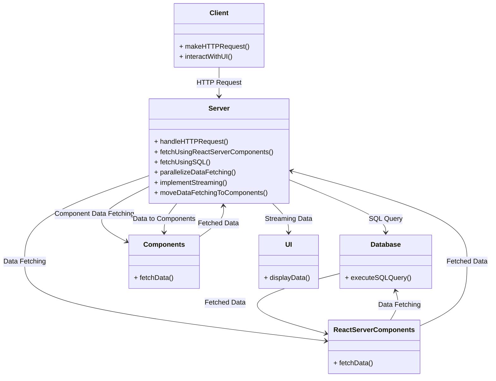

# dashboard-invoices

**Developed by** **`Grace Chen Abudi`** 👩🏽‍💻

## 📣 Overview:

- [dashboard-invoices](#dashboard-invoices)
  - [📣 Overview:](#-overview)
  - [🔎 Intro:](#-intro)
  - [🧰 Tech Stack:](#-tech-stack)
  - [🛠️ Techniques and Tools:](#️-techniques-and-tools)
  - [🏗️ Architecture Overview:](#️-architecture-overview)
    - [🗝️ Key Components Include:](#️-key-components-include)
    - [🔄 Interactions:](#-interactions)
    - [📚 Inclusion Summary:](#-inclusion-summary)
- [✨ How to Get Started:](#-how-to-get-started)
- [🚀 Live Project:](#-live-project)

---

## 🔎 Intro:

This is a dynamic full-stack app centered around the creation of a dashboard. This meticulously crafted dashboard displays and manages a collection of invoices, showcasing the capabilities and versatility of Next.js. This is a practice project in Next.js.

## 🧰 Tech Stack:

- Next.js
- TypeScript
- JavaScript
- TailwindCSS
- Responsive Layout
- Vercel
- Relational Database - PostgreSQL
- SQL + SQL Queries
- ZOD

## 🛠️ Techniques and Tools:

- **`clsx`**: A tiny utility for constructing className strings conditionally.
- **`Next.js Hooks`**: usePathname, useSearchParams, useRouter.
- **`Vercel Postgres`** is a serverless SQL database designed to integrate with Vercel Functions and your frontend framework.
- **`seed scripts`**: Contains the instructions for creating and seeding the **invoices**, **customers**, **user**, and the **revenue** tables.
- **`Server Components`**: Server Components facilitate asynchronous tasks with promises, enabling streamlined async/await syntax. They execute server-side, optimizing data fetches and logic, allowing direct database querying without an extra API layer.
- **`Request Waterfalls`**: A **"waterfall"** denotes a series of network requests reliant on prior completions. While useful for conditional dependencies, it can inadvertently impede performance in unintentional instances, emphasizing the need for careful consideration in system design.
- **`Parallel Data Fetching`**: A common way to avoid waterfalls is to initiate all data requests at the same time - in parallel. In JavaScript, you can use **"Promise.all()"** or **"Promise.allSettled()"** for performance gains. This native pattern is versatile but consider potential delays if one request lags behind others.
- **`Dynamic Rendering`**: Dynamic rendering renders the content on the server for each user at the request time. Benefits include real-time data display, user-specific content, and access to request-time information. However, application speed is constrained by the slowest data fetch.
- **`Streaming`**: Streaming is a data transfer technique that allows you to break down a route into smaller "chunks" and progressively stream them from the server to the client as they become ready.
- **`Debouncing (Best Practice)`**: **Debouncing** is a programming practice that limits the rate at which a function can fire. In this project, it's used for query the database when the user has stopped typing.
- **`Pagination`**: **Pagination** allows users to navigate through the different pages to view all the invoices.
- **`Server Actions`**
- **`Next.js APIs`**: error handling, notFound function
- **`Next.js Auth`**: Authentication and Authorization

---

## 🏗️ Architecture Overview:

### 🗝️ Key Components Include:

- **_<ins>Client Class:</ins>_** Represents the client-side application responsible for making HTTP requests and interacting with the user interface.
- **_<ins>Server Class:</ins>_** The server-side component, handling HTTP requests, fetching data using **Server Components** and **SQL**, parallelizing data fetching, implementing streaming, and moving data fetching logic to components.
- **_<ins>Database Class:</ins>_** Manage database interactions, executing **SQL queries** to retrieve and store data.
- **_<ins>ReactServerComponent Class:</ins>_** Fetches data on the server, optimizing expensive data fetches and logic.
- **_<ins>Components Class:</ins>_** Handles data fetching on the server, contributing to partial prerendering.
- **_<ins>UI Class:</ins>_** Responsible for displaying data to the user.

### 🔄 Interactions:

1. **<ins>Client to Server:</ins>** Initiates HTTP requests triggering server-side operations.
2. **<ins>Server to Database:</ins>** Execute **SQL queries** for targeted data retrieval.
3. **<ins>Server to ReactServerComponents:</ins>** Utilizes React Server Components for efficient server-side data fetching.
4. **<ins>ReactServerComponents to Database:</ins>** Fetches data from the database securely.
5. **<ins>ReactServerComponents to Server and Components:</ins>** Transmits fetched data to both server and components.
6. **<ins>Server to Components:</ins>** Distributes data to specific components.
7. **<ins>Server to UI:</ins>** Employs streaming to enhance user interaction, displaying data progressively.

### 📚 Inclusion Summary:

This architecture seamlessly integrates client and server-side components, optimizing data flow.

Key elements like **Client**, **Server**, **Database**, **ReactServerComponents**, **Components**, and **UI** collaboratively enhance data fetching, processing, and presentation.

Interactions demonstrate a well-orchestrated system, utilizing streaming for responsive user interfaces. Overall, it excels in efficiency, component streamlining, and user interface responsiveness, establishing a robust foundation for a user-friendly application.

---

# ✨ How to Get Started:

---

# 🚀 Live Project:

- `Visit the App` [&#128073;&#127997; **HERE !**](https://dashboard-invoices-zeta.vercel.app/)

---
